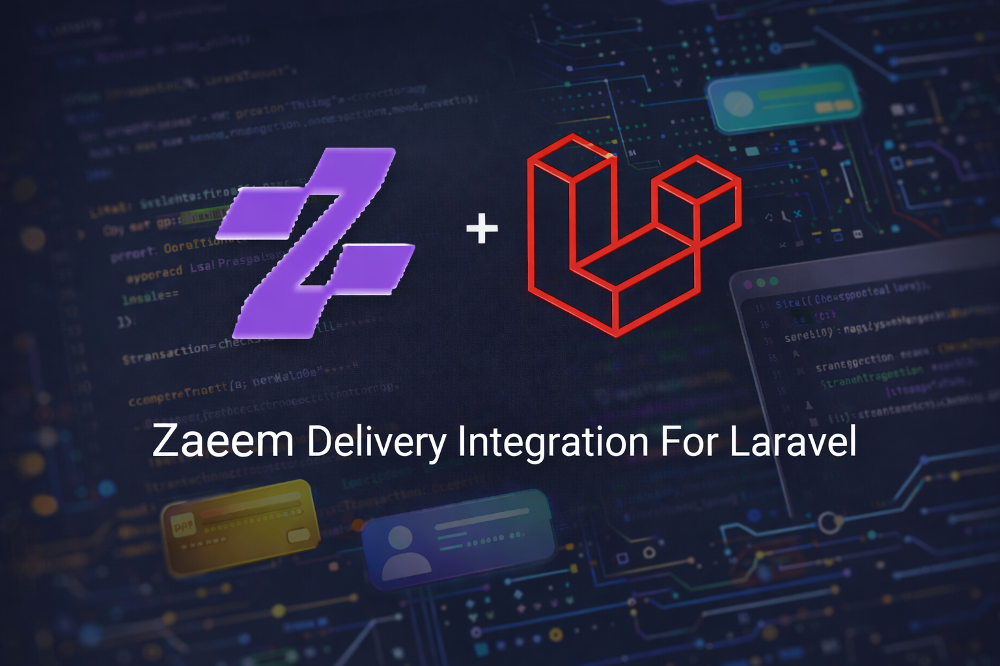

# Zaeem Delivery integration for laravel. 

[](https://packagist.org/packages/ht3aa/zaeem-delivery)
[](https://packagist.org/packages/ht3aa/zaeem-delivery)




Zaeem Delivery integration for Laravel. You will find all the functionality you need to make shipments with Zaeem Delivery logistics, including store management, shipment creation, real-time webhook integration for status updates, and reference data synchronization.

## Installation

You can install the package via composer:

```bash
composer require ht3aa/zaeem-delivery
```

## Configuration

Publish the configuration file:

```bash
php artisan vendor:publish --tag="zaeem-delivery-config"
```

Add the following environment variables to your `.env` file:

```env
ZAEEM_DELIVERY_USERNAME=your_username
ZAEEM_DELIVERY_PASSWORD=your_password
ZAEEM_DELIVERY_SYSTEM_CODE=your_system_code
```

## Database Migrations

Publish the migrations:

```bash
php artisan vendor:publish --tag="zaeem-delivery-migrations"
```

Then run the migrations to create the necessary tables:

```bash
php artisan migrate
```

This will create the following tables:
- `zaeem_governorates` - Stores governorate reference data
- `zaeem_cities` - Stores city reference data
- `zaeem_stores` - Stores your Zaeem Delivery store information
- `zaeem_shipments` - Stores shipment information
- `zaeem_shipment_updates` - Stores shipment status updates received from webhooks

## Usage

### Authentication

Before making API calls, you need to authenticate:

```php
use Ht3aa\ZaeemDelivery\Facades\ZaeemDelivery;

ZaeemDelivery::login();
```

### Creating a Store

Create a new store in Zaeem Delivery:

```php
use Ht3aa\ZaeemDelivery\Facades\ZaeemDelivery;
use Ht3aa\ZaeemDelivery\Models\ZaeemStore;

// make zaeem store object
$store = ZaeemStore::make([
    'store_name' => 'My Store',
    'store_phone' => '1234567890',
    'governorate_code' => 'GOV001',
    'address' => '123 Main Street',
    'latitude' => 31.2001,
    'longitude' => 29.9187,
    'owner_id' => auth()->id(),
    'owner_type' => auth()->user()->getMorphClass(),
]);

// create store in zaeem
$createdStore = ZaeemDelivery::createStore($store);

// save the store in the database
$createdStore->save();

```

### Creating a Shipment

Create a new shipment:

```php
use Ht3aa\ZaeemDelivery\Facades\ZaeemDelivery;
use Ht3aa\ZaeemDelivery\Models\ZaeemShipment;

$shipment = new ZaeemShipment([
    // Add your shipment data here
    // make sure to include all the needed fields and especilly the store_id field (even if it nullabel)
    // it required to identifiy the store
]);

$createdShipment = ZaeemDelivery::createShipment($shipment);

$createdShipment->save();
```

### Webhook Integration

The package provides a webhook endpoint to receive shipment status updates from Zaeem Delivery.

#### Configure Webhook URL

In your Zaeem Delivery dashboard, configure the webhook URL to:

```
https://yourdomain.com/api/zaeem-delivery/v2/push/update-status
```

The webhook endpoint will automatically:
- Validate the incoming system code
- Store all shipment updates in the `zaeem_shipment_updates` table
- Update the shipment status if a matching shipment is found

#### Webhook Payload

Zaeem Delivery will send POST requests with the following structure:

```json
{
  "system_code": "your_system_code",
  "updates": [
    {
      "shipment_number": "SH123456",
      "external_id": "ORDER-001",
      "action_code": "DELIVERED",
      "current_step": "Delivered",
      "current_step_ar": "تم التسليم",
      "current_stage": "final",
      "current_stage_ar": "نهائي",
      "governorate_code": "GOV001",
      "governorate_name": "Baghdad",
      "note": "Delivered successfully",
      "agent_latitude": 33.3152,
      "agent_longitude": 44.3661,
      "amount_iqd": 25000,
      "amount_usd": 0,
      "quantity_delivered": 1,
      "quantity_returned": 0
    }
  ]
}
```

#### Accessing Shipment Updates

You can access shipment updates through the `ZaeemShipmentUpdate` model:

```php
use Ht3aa\ZaeemDelivery\Models\ZaeemShipment;
use Ht3aa\ZaeemDelivery\Models\ZaeemShipmentUpdate;

// Get all updates for a specific shipment
$shipment = ZaeemShipment::where('shipment_number', 'SH123456')->first();
$updates = ZaeemShipmentUpdate::where('zaeem_shipment_id', $shipment->id)->get();

// Get the latest update
$latestUpdate = ZaeemShipmentUpdate::where('zaeem_shipment_id', $shipment->id)
    ->latest()
    ->first();

// Access update data
echo $latestUpdate->updates['current_step'];
echo $latestUpdate->updates['note'];
```

### Fetching Reference Data

#### Fetch Governorates

Sync governorates from the Zaeem Delivery API:

```bash
php artisan zaeem:fetch-governorates
```

This command will fetch all governorates and store them in the `zaeem_governorates` table.

#### Fetch Cities

Sync cities from the Zaeem Delivery API:

```bash
php artisan zaeem:fetch-cities
```

If the command fails at some point, you can resume from a specific page:

```bash
php artisan zaeem:fetch-cities --start=5
```

### Using Models

#### ZaeemGovernorate Model

```php
use Ht3aa\ZaeemDelivery\Models\ZaeemGovernorate;

// Get all governorates
$governorates = ZaeemGovernorate::all();

// Find by code
$governorate = ZaeemGovernorate::where('code', 'GOV001')->first();
```

#### ZaeemCity Model

```php
use Ht3aa\ZaeemDelivery\Models\ZaeemCity;

// Get all cities
$cities = ZaeemCity::all();

// Find by city ID
$city = ZaeemCity::where('city_id', 123)->first();

// Get cities by governorate
$cities = ZaeemCity::where('governorate_code', 'GOV001')->get();
```

#### ZaeemShipment Model

```php
use Ht3aa\ZaeemDelivery\Models\ZaeemShipment;

// Get all shipments
$shipments = ZaeemShipment::all();

// Find by shipment number
$shipment = ZaeemShipment::where('shipment_number', 'SH123456')->first();

// Find by external shipment ID
$shipment = ZaeemShipment::where('external_shipment_id', 'ORDER-001')->first();

// Get shipment with relationships
$shipment = ZaeemShipment::with(['store', 'governorate'])->find(1);

// Check shipment status
echo $shipment->status;
```

#### ZaeemShipmentUpdate Model

```php
use Ht3aa\ZaeemDelivery\Models\ZaeemShipmentUpdate;

// Get all updates for a shipment
$updates = ZaeemShipmentUpdate::where('zaeem_shipment_id', 1)->get();

// Get latest updates
$latestUpdates = ZaeemShipmentUpdate::latest()->take(10)->get();

// Access update data
foreach ($updates as $update) {
    echo $update->updates['current_step'];
    echo $update->updates['note'];
    echo $update->created_at;
}
```

## Available Commands

- `zaeem:fetch-governorates` - Fetch and sync governorates from Zaeem Delivery API
- `zaeem:fetch-cities` - Fetch and sync cities from Zaeem Delivery API (supports `--start` option to resume from a specific page)

## Features

- ✅ Authentication with Zaeem Delivery API
- ✅ Store creation and management
- ✅ Shipment creation and tracking
- ✅ Webhook integration for real-time shipment status updates
- ✅ Governorate and city reference data synchronization
- ✅ Eloquent models for shipments, updates, governorates, cities, and stores
- ✅ Repository pattern for processing webhook updates
- ✅ Automatic shipment status updates via webhooks
- ✅ Database migrations included
- ✅ Artisan commands for data synchronization
- ✅ Configurable API endpoints and credentials
- ✅ Transaction support for reliable data processing

## Requirements

- PHP ^8.4
- Laravel ^11.0 or ^12.0

Please see [CHANGELOG](CHANGELOG.md) for more information on what has changed recently.

## Contributing

Please see [CONTRIBUTING](CONTRIBUTING.md) for details.

## Security Vulnerabilities

Please review [our security policy](../../security/policy) on how to report security vulnerabilities.

## Credits

- [Hasan Tahseen](https://github.com/ht3aa)
- [All Contributors](../../contributors)

## License

The MIT License (MIT). Please see [License File](LICENSE.md) for more information.
